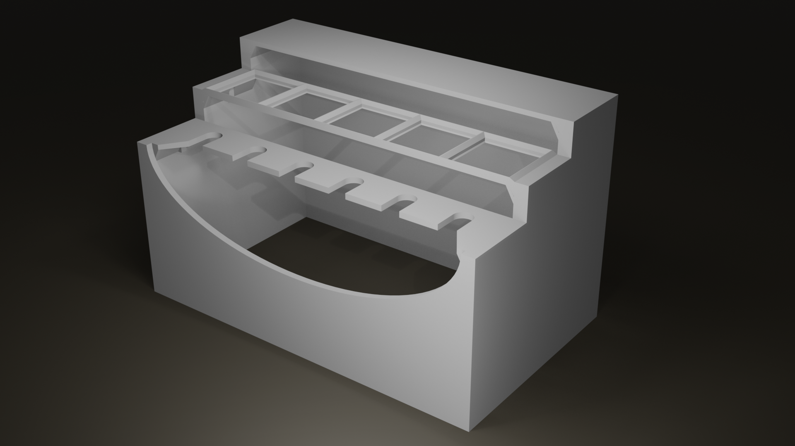
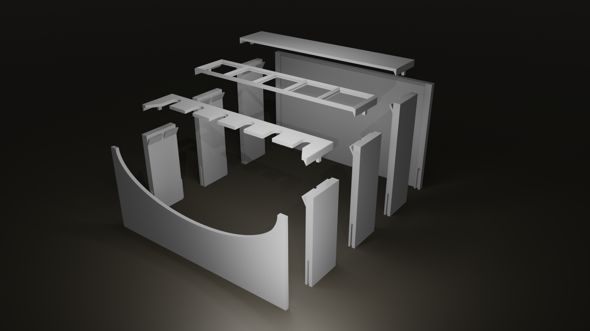
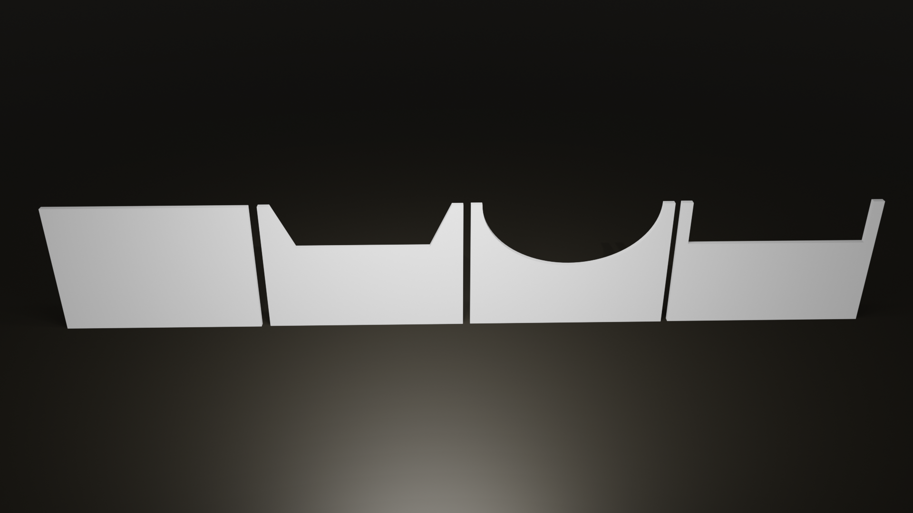
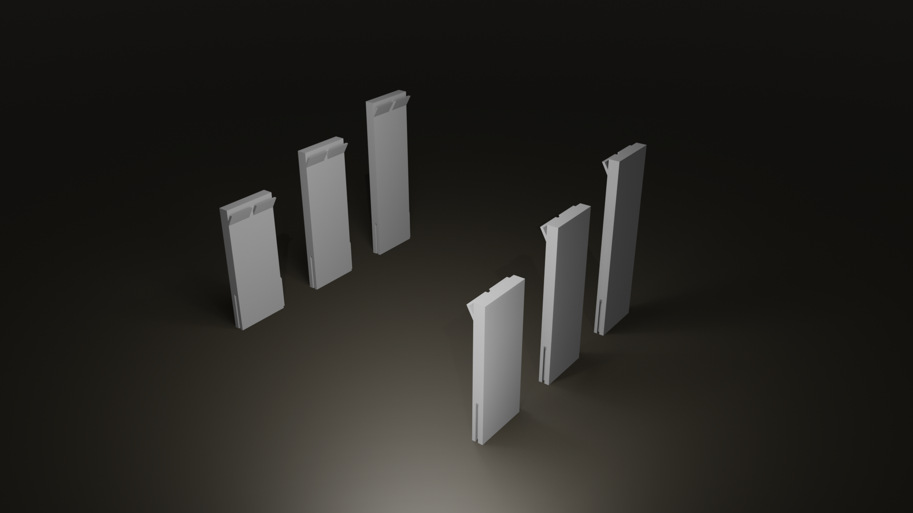
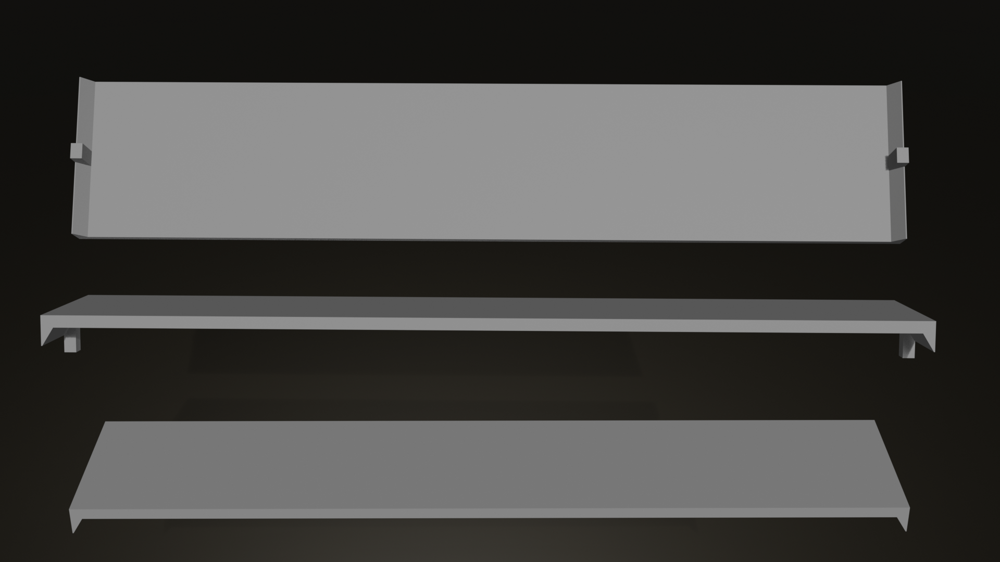
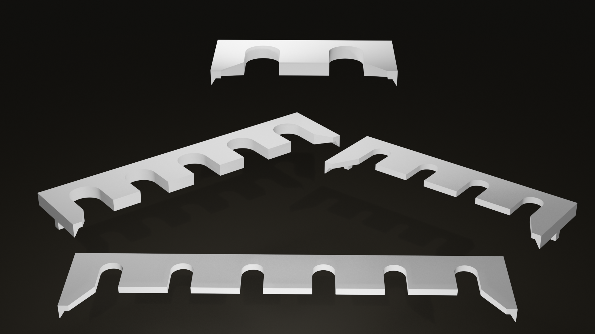
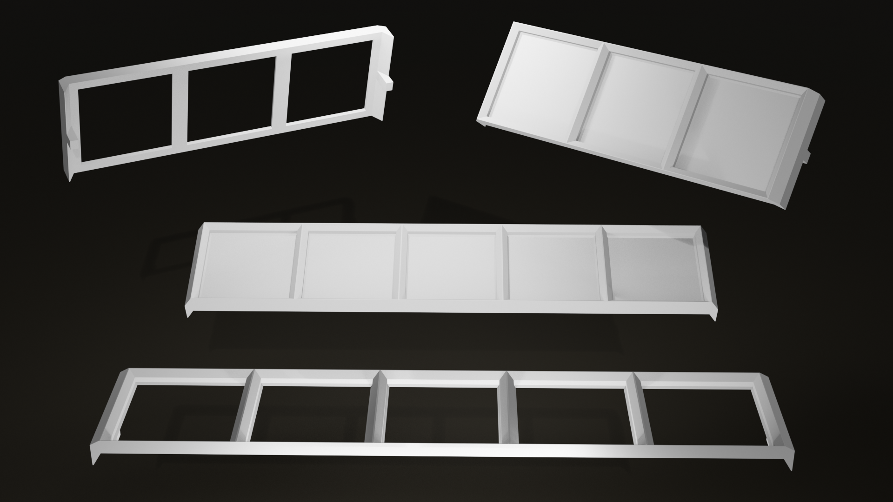

# The Modular Paint Stack

The Modular Paint Stack (MPS) is a modular, parametric paint storage system for 3D printing. 

The stack consists of a front, multiple sides, a back, and various shelves. The front, sides, and back are all connected with simple sliding dovetails. They can range from 30mm high to as high as your printer can print. The sides have shelf supports that shelves can rest on. Typically, the shelf supports are near the top, but they can also be positioned lower to better handle paints that must be standing and not hanging. Each shelf has a support on both sides (3mm each) and the center is based on Gridfinity units. A printer with a 250mm print width can print shelves up to 5 Gridfinity units wide.

## Front and back

The front and back can be plain or have a shape cut into them. The whole MPS is assembled from front to back, making it easier to decide how much higher each subsequent shelf needs to be. That means the front piece has dovetails on its back that the sides slide down into and the back piece has slots on its front to slide into dovetails.

## Sides

Sides are essentially rectangles with a slot in the front and a dovetail in the rear, allowing any number of sides to be joined. They also have a paint shelf support on the inside. With hanging paint shelves, it's common to have sides get taller farther back to make it easier to see and grab paint tubes. A 40mm difference works well for many brands, but a 20mm difference is fine for small tubes. Very large tubes may need a larger difference. The dovetails allow the shelves to flex away from each other very slightly at the top, which is helpful for getting larger tubes out, but you can also add a dab of CA glue if you prefer them to be more rigid.

## Shelves

The shelves are where things get interesting. The simplest shelf is flat across the top and uses a support on each end to lock into place. This can be handy for setting paint supplies on such as paint mediums. You can also print the sides with the shelf supports on the bottom or offset from the bottom, which can help if you want the shelf to be lower instead of at the top.

### Hanging paint shelves

Most paint tubes can hang, so there is a specific script for generating cutouts. Since tubes in different paint lines or across different manufacturers vary, it's important to measure the "neck" of each tube carefully. There is also a list of [known sizes](known_sizes.md) for a variety of paint brands.

### Standing paint shelves

Coming soon!

### Gridfinity shelves

There are two types of Gridfinity shelves: solid and skeleton. A solid shelf is basically just a shelf with a Gridfinity base added on top. This uses more filament and is only necessary for heavier storage. The skeleton version replaces the main part of the shelf with a Gridfinity base. This is suitable for light and medium duty applications and saves some filament.

### Paint brush shelves

Coming soon!
